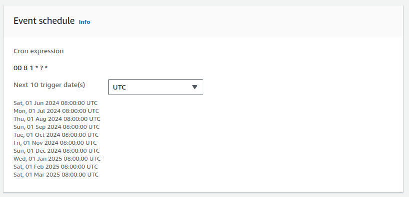

# Serverless EBS Volume Deletion and Snapshots using Lambda Function #


This serverless function aims to enhance the clean-up process for `EBS volumes` that
have been created but somehow left unattached to `EC2 instances`, making the maintenance process
automated and easier.

<!-- TOC -->
* [Serverless EBS Volume Deletion and Snapshots using Lambda Function](#serverless-ebs-volume-deletion-and-snapshots-using-lambda-function-)
    * [Pre-Requisites](#pre-requisites-)
* [Configuration](#configuration-)
  * [Step 1: Set up Lambda function](#step-1-set-up-lambda-function-)
  * [Step 2: Configure `CloudWatch Event` Lambda Triggers](#step-2-configure-cloudwatch-event-lambda-triggers-)
  * [Step 3: Verify EBS Volumes in AWS Dashboard](#step-3-verify-ebs-volumes-in-aws-dashboard-)
<!-- TOC -->


In 3 simple steps, this function is going to clean up the `EBS volumes` in `available` state and back them up at the same time.

- Step 1 - Set up Lambda function that will perform the following:
  - Scan EBS Volumes instances in the current region
  - Filter instances based on the `Volume state` - All unattached volumes or with `Available` state
  - Once they are filtered, it will exclude EBS Volumes with the tag: `'Do-Not-Delete'`
  - Initiate the process to create a backup via snapshots
  - Proceed with the deletion of the unattached EBS volume.
- Step 2 - Configure Lambda Triggers - Amazon `EventBridge` rule
- Step 3 - Verify EBS Volumes / Snapshots in EC2 Dashboard


### Pre-Requisites ###

You will need the following pre-requisites to successfully complete this activity
* IAM Role - i.e `Lambda Service Role` with `EC2FullAccess` permission

```  
  {
      "Version": "2012-10-17",
      "Statement": [{
          "Action": "ec2:*",
            "Resource": "*",
            "Effect": "Allow",
      }]
  }
```

* Tag all unattached volumes (`available` state) with the `Do-Not-Delete` if you wish to keep these instances before setting up this severless function.
* If there are any EBS Volumes with a different tag and unattached, they will be backed up and removed.

### Configuration ###

# Step 1: Set up Lambda function #
* Create a AWS Lambda function and choose python 3.12 as the runtime and copy paste the code in this repository.
* Change the global variables at the top of the script to suit your needs. For example, change the default region and tags if needed.

# Step 2: Configure `Amazon EventBridge` rule #
* Use Amazon EventBridge rules to trigger the lambda function once per month. i.e. the following expression ruins the rule every month at 8:00AM UTC.
  


* Select target lambda function created in step 1.

Other expressions can be configured if the lambda function should run with more frequency.
```
rate(1 minute)
or
rate(5 minutes)
or
rate(1 day)
```

Learn more about the Scheduled expressions here: [CloudWatch - Schedule Expressions](http://docs.aws.amazon.com/AmazonCloudWatch/latest/events/ScheduledEvents.html#RateExpressions)

# Step 3: Verify EBS Volumes in AWS Dashboard #
* Verify that EBS Volumes with the `Do-Not-Delete` tag are retained
* Verify that EBS Volumes in `available` state are backed up in its corresponding snapshot and deleted from the list of EBS Volumes.
